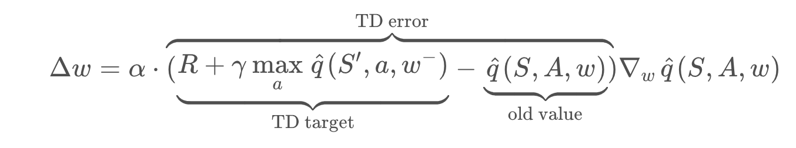
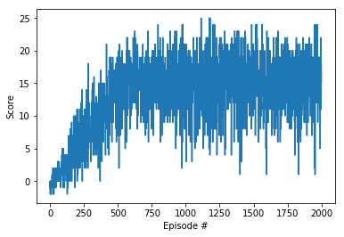
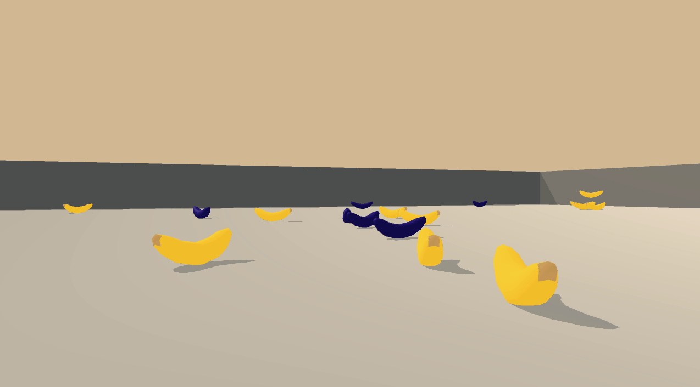

# Project Report

### Algorithm

This project uses Vanilla Deep Q Learning algorithm with fully connected deep neural network.

Key features:

* Deep Q-Learning algorithm represents the optimal action-value function as **a neural network** (instead of a Q-table).
* **input:** environment state.
* **output:** vector of action values for the current state. Max value indicates an action to take.
* **Experience Replay:** a sequence of experience might be highly correlated. To avoid this, we keep track of a replay buffer (which is a collection of tuples `(state, action, reward, next_state)`) and using experience replay to sample from the buffer at random.
* **Fixed Q-Targets** - target Q-network weights are updated less often then primary Q-network weights. This helps to avoid harmful correlations:



DNN Layers:

* **input layer**: 37 nodes (environment state size)
* **hidden layer**: 64 nodes, ReLU
* **output layer**: 4 nodes (number of available actions)

Hyperparameters:

* **replay buffer size**: `10,000` - _max number of experiences to store in the replay buffer._
* **batch size**: `64` - _how many random experiences to pick from the replay buffer._
* **learning rate**: `0.0005` - _controls how much we are adjusting the weights of the network._
* **discount**: `0.99` - _determines the importance of future rewards: `1` - all future rewards are important, `0` - only immediate reward is important._
* **epsilon**: `start=1.0`, `end=0.01`, `decay=0.995` - _epsilon reflects how random a policy should be: `1` - totally random policy, `0` - greedy policy (always chooses an action with max value)._
* **number of episodes**: `2000` - _how many episodes to play during training._

### Training



```
Episode 100     Average Score: 0.78
Episode 200     Average Score: 3.56
Episode 300     Average Score: 6.97
Episode 400     Average Score: 9.60
Episode 500     Average Score: 12.70
Episode 600     Average Score: 14.40
Episode 700     Average Score: 15.20
Episode 800     Average Score: 15.14
Episode 900     Average Score: 14.60
Episode 1000    Average Score: 14.66
Episode 1100    Average Score: 14.54
Episode 1200    Average Score: 15.07
Episode 1300    Average Score: 15.36
Episode 1400    Average Score: 15.98
Episode 1500    Average Score: 15.54
Episode 1600    Average Score: 15.28
Episode 1700    Average Score: 15.06
Episode 1800    Average Score: 15.86
Episode 1900    Average Score: 14.53
Episode 2000    Average Score: 15.69
```

### Results

Random agent


Dumb agent (before training)



Smart agent (after training)


Average score for 100 episodes: 16.53

### Future ideas

1. Learn from pixels
2. Double DQN
3. Prioritized Experience Replay
4. Dueling Deep Q Networks
5. Rainbow
